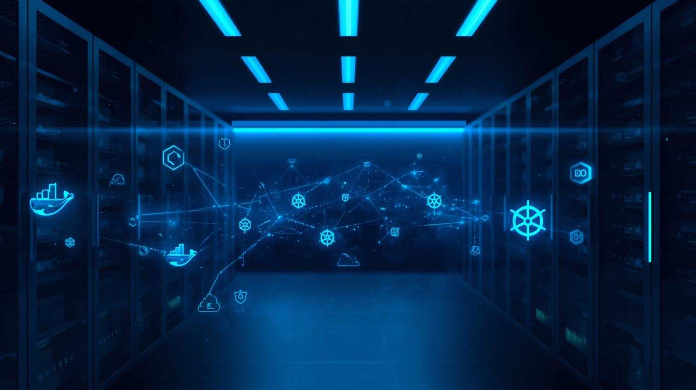

# 👋 Saif-Eddine El Khantache  
### Ingénieur Informatique · IA · DevOps · Full Stack

🎓 Double diplômé **EILCO (France)** 🇫🇷 & **ENSIAS (Maroc)** 🇲🇦  
🚀 Passionné par l’IA appliquée, le DevOps et les plateformes SaaS  
🔍 À la recherche d’un **stage d’été suivi d’une alternance**

---

## 🧠 À propos de moi

Je suis étudiant ingénieur en informatique, spécialisé en **Intelligence Artificielle**, **DevOps** et **développement Full Stack**.

J’aime concevoir des **systèmes intelligents, robustes et scalables**, allant de la **conception du modèle IA** jusqu’au **déploiement Cloud automatisé**.

💡 Actuellement, je travaille sur :
- une **plateforme SaaS de feedback client** enrichie par l’IA  
- des projets combinant **LLM, NLP, Cloud & CI/CD**

---

## 🛠️ Stack technique

### 👨‍💻 Développement & Backend

  

- **Python**, **Java**, **C++**, **JavaScript**
- Frameworks backend : **Flask**, **FastAPI**, **JEE**
- Frontend : **React.js**
- Scripting & systèmes : **Shell (Bash)**

---

### 🤖 Intelligence Artificielle & Data
- **Deep Learning** : PyTorch, TensorFlow  
- **NLP & LLM** : BERT, modèles génératifs, fine-tuning  
- **GANs** : architectures génératives & stabilisation  
- **Graph Data Science** : Neo4j, PageRank, Louvain  
- **Machine Learning** : régression, classification  
- **Data Visualization** : Matplotlib, Seaborn  

---

### 🗄️ Bases de données & Data
- **PostgreSQL**
- **Neo4j (Graph DB)**
- **NoSQL**
- Modélisation & analyse de données

---

### ☁️ DevOps, Cloud & Infrastructure

  

- **Containerisation** : Docker  
- **Orchestration** : Kubernetes  
- **Infrastructure as Code** : Terraform, Ansible  
- **CI/CD** : Jenkins  
- **Cloud** : AWS (EC2, S3, IAM)  
- **Versioning & OS** : Git, Linux  

---

### 📊 Méthodes & Gestion de projet
- **Agile / Scrum**
- **Jira**
- Travail en sprints, daily meetings, delivery continu

---

## 🚀 Projets clés

### 🔹 Plateforme SaaS de Feedback Client (IA)
**IA · Product · Full Stack · DevOps**

- Collecte d’avis multi-canal (SMS, Email, QR Code)
- Analyse automatique des feedbacks par IA (**Radar IA**)
- Tableaux de bord décisionnels (NPS, insights clients)
- Architecture scalable orientée SaaS

---

### 🔹 AI-Powered PDF Analyzer
**LLM · DevOps · Cloud**

- Analyse intelligente de documents PDF complexes
- Extraction de données structurées via LLM
- Déploiement Cloud automatisé (Terraform, Kubernetes, Jenkins)

---

### 🔹 Détection de Fake News
**NLP · Graph · Deep Learning**

- Base de données graphe (Neo4j) pour analyse relationnelle
- PageRank & Louvain pour propagation de l’information
- Fine-tuning de BERT (>99 % de précision)

---

## 🏆 Certifications

- 🎓 **Master DevOps** – Edureka  
- 🤖 **GANs Specialization** – DeepLearning.AI  
- ☁️ **Cloud AWS Foundations** – IBM  
- 📊 **Machine Learning & Data Visualization** – IBM  

---

## 🌍 Langues
- 🇫🇷 Français : C2  
- 🇬🇧 Anglais : B2  
- 🇲🇦 Arabe : Langue maternelle  

---

## 📫 Me contacter

  
  

---

⭐ *N'hésitez pas à explorer mes projets ou à me contacter pour toute collaboration !*
